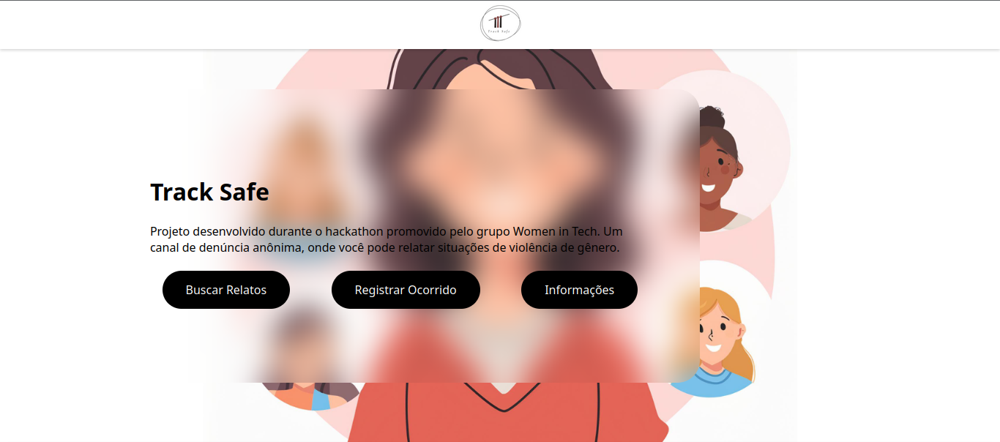
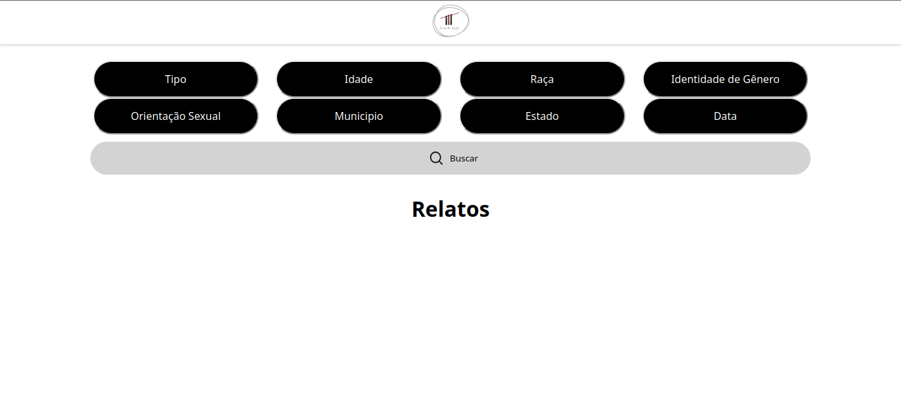
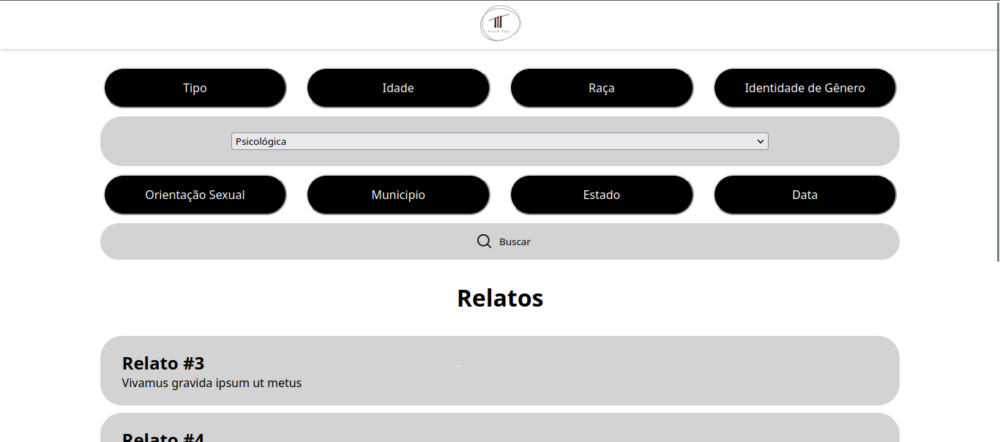
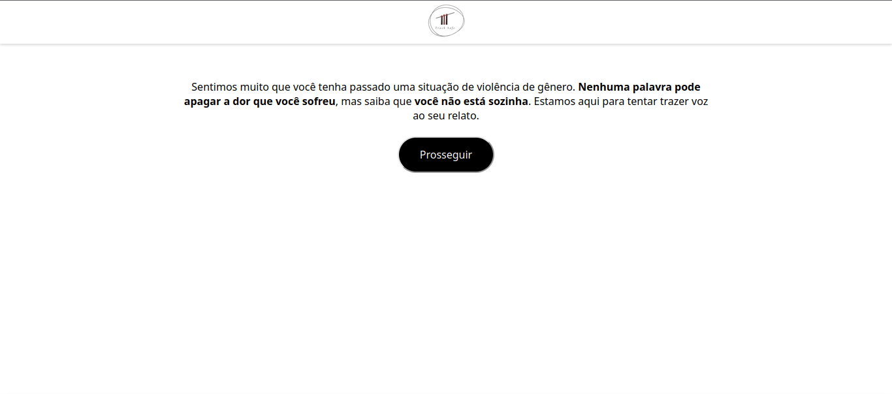
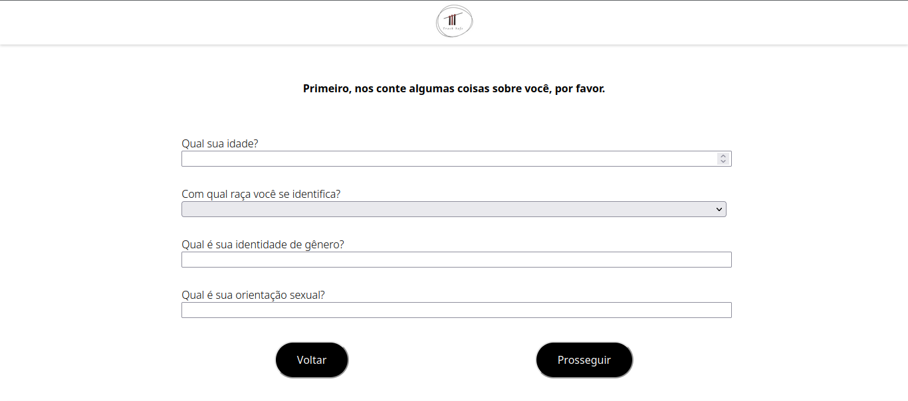
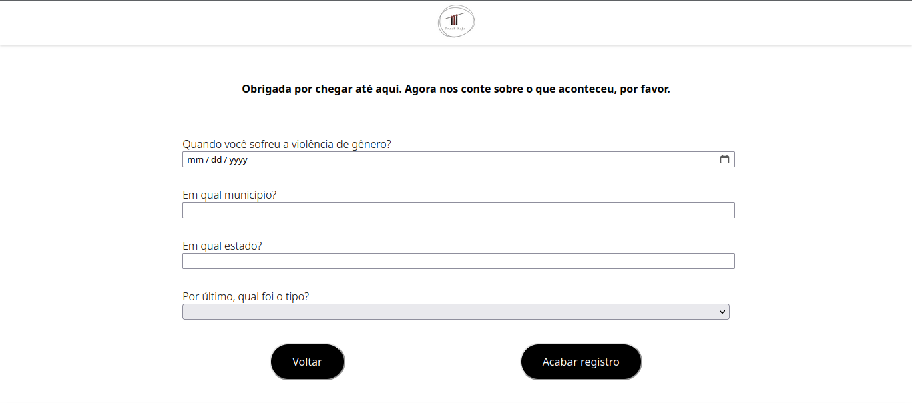
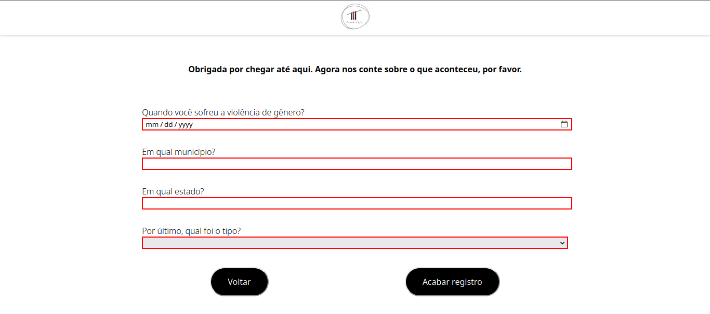
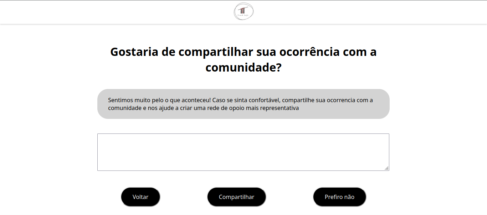

# Track Safe

Project developed during the Women in Tech hackathon, focused on combating gender-based violence. On the Track Safe platform, anonymous users can report instances of gender-based violence they have experienced, and if they feel comfortable, they are directed to official reporting channels. Additionally, users can search for accounts from victims who have gone through similar situations, creating a support network.

The project was developed using the Node.js, React and Express.js frameworks, and the SQLite database management system.

## Front-end

### Prototyping in Figma

The prototype can be found [here](https://www.figma.com/design/jTDlhrXqCe70yfmMfpCW8k/Prot%C3%B3tipoTrackSafe?node-id=0%3A1&t=MtpVVxI7hjwADaPb-1).

### Pages

The site has 4 screens: 

- home page, from which users can access the other pages; 
- reporting page, where users fill out a form to report an incident; 
- search page, where users can look for descriptions of gender-based violence; 
- information page, where users are directed to official reporting channels.

## Back-end

### Database Modeling

The database has a single table for incidents.

```SQLite
CREATE TABLE "ocorrido" (
	"id"	SERIAL PRIMARY KEY,
	"idade"	INTEGER,
	"raca"	TEXT,
	"identidade_genero"	TEXT,
	"orientacao_sexual"	TEXT,
	"tipo"	TEXT NOT NULL CHECK ( tipo IN ('Física', 'Psicológica', 'Sexual') ),
	"municipio"	TEXT NOT NULL,
	"estado"	TEXT NOT NULL CHECK ( estado IN ('AC','AL','AP','AM','BA','CE','ES','GO','MA','MT','MS','MG','PA','PB','PR','PE','PI','RJ','RN','RS','RO','RR','SC','SP','SE','TO','DF') ),
	"data"	TEXT NOT NULL,
	"descricao"	TEXT,
)
```

### Routes

There are two routes: GET on '/api/ocorridos', which receives as request parameters type, city, state, date, age, race, sexual orientation and gender identity, and returns the incidents that match the query and have a non-empty description field; and POST on '/api/ocorridos', which receives all fields of the incidents table in the request and inserts a new record into the table.

### Mock data

Eleven simulated entries were created in the database. These can be found in the 'documents' folder.

## Improvements

Improvements that can be made to the project recorded so far:

- Search is currently triggered by pressing '\n' in one of the text input fields; a search button should be implemented.
- Close the input field when the search is performed.

## Screenshots








